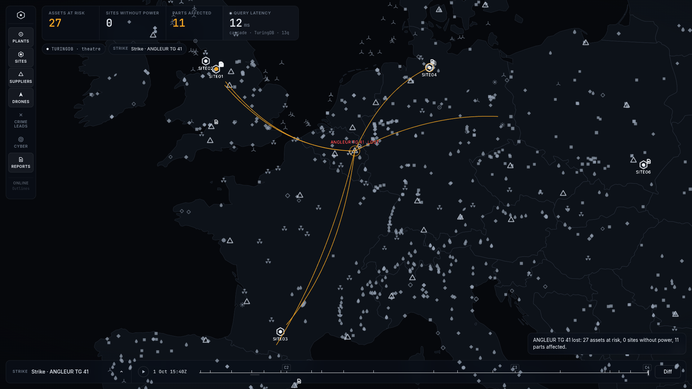

# OpsMap UI

The operating picture for the `theatre` graph: a full-bleed MapLibre map with deck.gl layers over the
FastAPI backend in [`../api`](../api). The HTTP contract is documented in [`../docs/api.md`](../docs/api.md).



## Run

```bash
# 1. API: mock fixtures (no TuringDB needed)
uv run uvicorn api.main:app --port 8000

#    ...or the live graph: start TuringDB on this repo, seed hypotheses, then serve
uv run turingdb start -turing-dir "$(pwd)" -demon -in-memory -load theatre -start-timeout 20000
OPSMAP_BACKEND=turingdb uv run python -m api.seed_hypotheses
OPSMAP_BACKEND=turingdb uv run uvicorn api.main:app --port 8000

# 2. UI (from ui/)
npm install
npm run dev            # http://localhost:5173, proxies /api -> :8000
```

`-in-memory` keeps strike branches out of the committed graph store. `npm run build && npm run preview`
serves the production bundle. `npm test` runs the unit tests and `npm run typecheck` runs `tsc`.

## Using it

| Do | What happens |
|---|---|
| Right-click an asset → **Simulate loss** | `POST /simulate` opens a strike branch. Arcs animate out from the struck node along the dependency chain, affected assets turn amber, lost ones red, and the KPI strip updates with the TuringDB query latency. |
| Click a node | The drawer shows its properties and neighbours grouped by relationship. Click a neighbour to fly to it. |
| Bottom bar, branch switcher | Hypothesis branches with confidence and strike branches. Switching re-colours the map from `GET /diff main→branch`. |
| **Diff** | Pick any two branches or commits to list what appeared, disappeared or changed. |
| Left rail | Layer toggles, plus the basemap switch. |

## Focused Dover demo

Run `.venv/bin/python scripts/run_dover_demo.py` from the repository root. The map on port 5174
shows only power plants, facilities, ports and the strait. Its indicators show affected facilities,
revealed cascade degree and query latency. The footer keeps branch comparison, Impact and Diff.
The historical timeline is removed. Empty worldwide layers, old agents/wargame controls,
manual strike actions and an unavailable basemap switch are omitted from this profile.
Node details and dependency exploration remain available. Full dataset handoff: [docs/dover.md](../docs/dover.md).

## Basemaps (no API keys)

- **CARTO dark-matter** (default, online).
- **PMTiles** (offline, air-gapped): put a file at `ui/public/basemap/theatre.pmtiles`, for example a
  regional extract made with `pmtiles extract https://build.protomaps.com/<date>.pmtiles theatre.pmtiles
  --bbox=-11,35,30,62 --maxzoom=10`, then toggle it in the rail or set `VITE_BASEMAP=pmtiles`. Labels need
  local glyphs (`VITE_BASEMAP_GLYPHS`). Without them the map renders unlabelled.
- **Outlines** (automatic fallback): if the chosen basemap fails to load, the map falls back to the bundled
  Natural Earth 1:50m country outlines (`public/basemap/countries-50m.json`), so the picture never sits on
  a blank canvas.

Both tiled styles are re-coloured by `muteStyle()` to the same navy palette with labels at 50% opacity.

| Env (`ui/.env.local`) | Default |
|---|---|
| `OPSMAP_API_TARGET` | `http://127.0.0.1:8000` (dev proxy target) |
| `VITE_API_BASE` | `/api` |
| `VITE_BASEMAP` | `carto` (`pmtiles` to start offline) |
| `VITE_CARTO_STYLE`, `VITE_PMTILES_URL`, `VITE_BASEMAP_GLYPHS`, `VITE_OUTLINES_URL` | see `src/map/basemap.ts` |

## Design and performance notes

- Colour carries meaning only: amber means selected or at risk, red means lost. Everything else is
  greyscale. Inter is used for UI text and JetBrains Mono for numbers, IDs and timestamps. Sized for a
  1080p projector.
- About 35k plant points: plants are filtered by zoom on the GPU (deck.gl `DataFilterExtension`), so only
  large plants show at continental scale and smaller ones appear as you zoom in. At-risk, lost and
  selected plants are always shown. Nodes load once per layer at startup, so panning and zooming never
  touch the network, and branch state is applied as an overlay.
- Motion respects `prefers-reduced-motion`: arcs and pulses render statically and fly-to becomes jump-to.
- `deck.gl` and `maplibre-gl` are split into their own chunks, and the PMTiles and outline code are
  lazy-loaded only when used.
